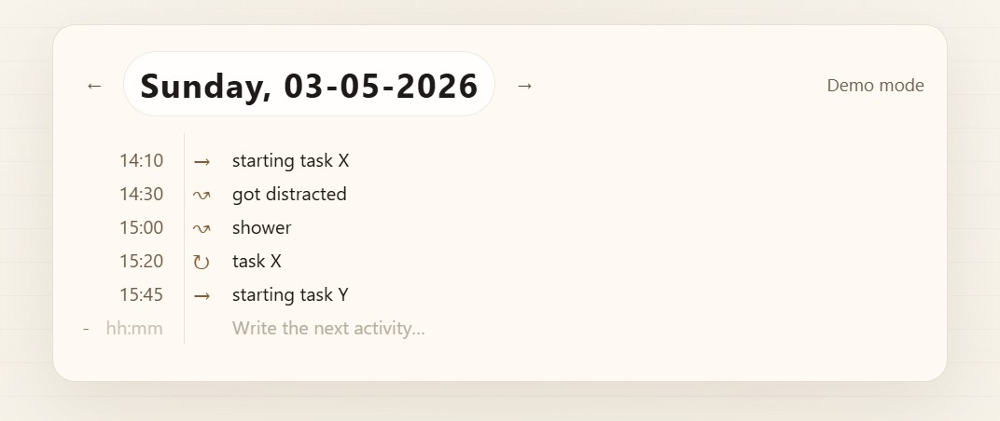

# Activity Switch Tracker

Simple personal tracker for logging context switches.

This is not a task manager. It does not track completion, productivity, failure, or blame.  
The goal is simply to add a small amount of friction before switching tasks.



## Symbols

The symbols are intentionally left open, but their original intention is:

```txt
→ chosen context
↝ context switch
↻ same context continues
```

## Setup

Install dependencies:

```bash
npm install
cd web && npm install && cd ..
```

Create a `.env` file in the project root:

```env
APP_PASSWORD_HASH=
SESSION_SECRET=
COOKIE_NAME=activity_session
NODE_ENV=production
PORT=3000
```

Generate the password hash:

```bash
node -e "require('bcryptjs').hash('your-password-here', 12).then(console.log)"
```

Generate the session secret:

```bash
openssl rand -hex 32
```

## Run

Start the backend:

```bash
npm run dev
```

Start the frontend dev server in a second terminal:

```bash
cd web
npm run dev
```

## Build

Build the frontend:

```bash
npm run build:web
```

Start the app:

```bash
npm run start
```

## Deploy

Run with PM2:

```bash
pm2 start "npm run start" --name activity-tracker
pm2 save
```

## Data

SQLite database lives at:

```txt
data/activity.sqlite
```

Back up these files:

```txt
data/activity.sqlite
data/activity.sqlite-wal
data/activity.sqlite-shm
```
